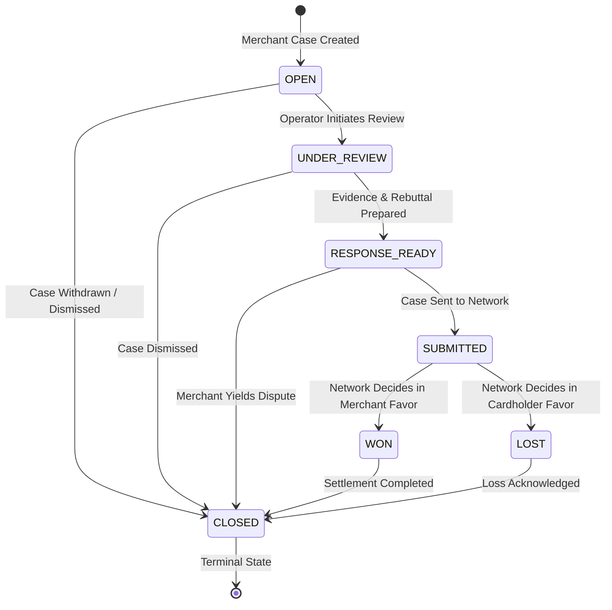

# Phase 2M — Chargeback Management Architecture & Documentation

## Overview

RiskyPlay's Chargeback Management subsystem provides a tenant-isolated, defense-only foundation for managing payment dispute cases. It models real card network lifecycles (Visa, Mastercard, American Express), enforces mathematical and state machine invariants, dynamically calculates deadline statuses, and produces immutable audit records for all lifecycle state transitions.

> [!IMPORTANT]
> **Defense-Only Scope & Non-Execution Boundary**:
> This phase manages chargeback cases and their internal lifecycles only. It does **not** submit dispute rebuttals to payment card networks, issue refunds, ban customer accounts, or execute financial actions. Automated evidence assembly and AI response generation are handled by subsequent, dedicated agent layers.

---

## 1. Chargeback Lifecycle & State Machine

Every chargeback progresses through an explicit, deterministic state transition graph. Illegal transitions, backward steps, and modifications from terminal states are strictly rejected with HTTP 400 (`INVALID_CHARGEBACK_TRANSITION`).



### Transition Matrix

| Current State | Permitted Next States | Description |
| :--- | :--- | :--- |
| **`OPEN`** | `UNDER_REVIEW`, `CLOSED` | Initial status upon intake. Actionable by dispute operators. |
| **`UNDER_REVIEW`** | `RESPONSE_READY`, `CLOSED` | Operator or evidence gathering agent actively collecting proof. |
| **`RESPONSE_READY`** | `SUBMITTED`, `CLOSED` | Defense packet and narrative assembled and QA-approved. |
| **`SUBMITTED`** | `WON`, `LOST` | Dispute packet delivered to acquiring bank/processor. |
| **`WON`** | `CLOSED` | Issuer awarded representment to merchant; funds restored. |
| **`LOST`** | `CLOSED` | Issuer sustained cardholder dispute; funds debited. |
| **`CLOSED`** | _None_ (Terminal) | Archival state. Reopening or transitions are forbidden. |

Legacy aliases (`RECEIVED`, `EVIDENCE_GATHERING`, `RESPONSE_GENERATED`) from Phase 2D are supported for backward compatibility and cleanly map into the modern lifecycle.

---

## 2. Dynamic Deadline Management

Card network dispute deadlines are legally binding and time-critical. Deadlines are evaluated dynamically in real time against the current UTC timestamp rather than relying on stale persisted indicators.

```
                  now                                   now + 3 days (72h)
───────────────────┬──────────────────────────────────────────┬────────────────────────► Time
  OVERDUE          │                 DUE_SOON                 │        UPCOMING
  (past deadline)  │          (0 to 72 hours remaining)       │   (> 72 hours remaining)
```

### Deadline Status Semantics

1. **`COMPLETED`**: Applied automatically when a case is in a terminal or resolved status (`WON`, `LOST`, `CLOSED`). The deadline is satisfied or moot and no merchant action is required.
2. **`OVERDUE`**: Assigned when `deadlineDate < now` for any active case (`OPEN`, `UNDER_REVIEW`, `RESPONSE_READY`, `SUBMITTED`).
3. **`DUE_SOON`**: Assigned when the deadline is within **3 days (72 hours)** of `now` (`0 <= remainingDays <= 3`).
4. **`UPCOMING`**: Assigned when more than 3 days remain until the deadline.

---

## 3. Case Number Uniqueness & Multi-Tenancy

Dispute reference numbers (such as network ARN or merchant case IDs) may overlap across different merchants. RiskyPlay enforces **merchant-scoped uniqueness**:

- **Compound Unique Index**: `{ merchantId: 1, caseNumber: 1 }` with `{ unique: true }`.
- Merchant A cannot create two chargebacks with case number `CASE-2026-001`. Attempting to do so returns **HTTP 409 `DUPLICATE_CHARGEBACK`**.
- Merchant B can freely use `CASE-2026-001` for their own transaction without conflict.
- All MongoDB queries, updates, and list operations enforce `{ merchantId: req.user.merchantId }`.

---

## 4. Transaction Verification & Financial Consistency

When a chargeback is created:
1. The associated transaction is resolved strictly using the authenticated merchant's identity:
   ```javascript
   Transaction.findOne({ _id: data.transactionId, merchantId })
   ```
2. If the transaction does not exist or belongs to another merchant, RiskyPlay returns **HTTP 404 `TRANSACTION_NOT_FOUND`**. A tenant can never verify or dispute another tenant's transactions.
3. The dispute amount must match the transaction amount:
   ```javascript
   Math.abs(data.disputeAmount - transaction.amount) < 0.001
   ```
   Mismatched amounts reject with **HTTP 400 `VALIDATION_ERROR`**.
4. The transaction record remains completely unchanged.

---

## 5. Audit Logging

Every successful status transition generates an immutable record in the `AuditLog` collection:

```json
{
  "entityType": "CHARGEBACK",
  "entityId": "60d5ecb8b5c9c62b3c7c1234",
  "actorId": "507f1f77bcf86cd799439011",
  "actorType": "MERCHANT",
  "action": "STATUS_CHANGED",
  "previousState": { "status": "OPEN" },
  "newState": { "status": "UNDER_REVIEW" },
  "reason": "Merchant operator initiated evidence gathering",
  "timestamp": "2026-09-05T20:30:00.000Z"
}
```

Audit logs never store passwords, JWTs, card numbers (PAN), CVVs, or unverified PII.

---

## 6. REST API Reference

All chargeback endpoints require a valid merchant JWT Bearer token (`Authorization: Bearer <token>`).

### 1. Create Chargeback
- **Endpoint**: `POST /api/v1/chargebacks`
- **Request Body**:
  ```json
  {
    "caseNumber": "CB-VISA-88291",
    "transactionId": "66da91f3a2c91b4e8832a101",
    "network": "VISA",
    "reasonCode": "10.4",
    "reasonDescription": "Fraud - Card Absent Environment",
    "disputeAmount": 199.99,
    "deadline": "2026-09-25T23:59:59.000Z"
  }
  ```
- **Response**: `201 Created`
  ```json
  {
    "success": true,
    "data": {
      "id": "66da921ea2c91b4e8832a105",
      "merchantId": "507f1f77bcf86cd799439011",
      "transactionId": "66da91f3a2c91b4e8832a101",
      "caseNumber": "CB-VISA-88291",
      "network": "VISA",
      "reasonCode": "10.4",
      "reasonDescription": "Fraud - Card Absent Environment",
      "disputeAmount": 199.99,
      "deadline": "2026-09-25T23:59:59.000Z",
      "deadlineStatus": "UPCOMING",
      "status": "OPEN",
      "generatedResponse": null,
      "createdAt": "2026-09-05T20:30:00.000Z",
      "updatedAt": "2026-09-05T20:30:00.000Z"
    }
  }
  ```

### 2. List Chargebacks
- **Endpoint**: `GET /api/v1/chargebacks`
- **Query Parameters**:
  - `page`: Page number (default: `1`)
  - `limit`: Items per page (default: `20`, max: `100`)
  - `status`: Filter by status (`OPEN`, `UNDER_REVIEW`, etc.)
  - `network`: Filter by card network (`VISA`, `MASTERCARD`, `AMEX`, `OTHER`)
  - `reasonCode`: Exact reason code match
  - `transactionId`: Filter by transaction ObjectId
  - `deadlineFrom` / `deadlineTo`: Filter by deadline date range
  - `from` / `to`: Filter by creation date range
  - `sortBy`: `'createdAt'` | `'deadlineDate'` | `'disputeAmount'` (default: `'createdAt'`)
  - `sortOrder`: `'asc'` | `'desc'` (default: `'desc'`)
- **Response**: `200 OK`
  ```json
  {
    "success": true,
    "data": [ ...items ],
    "pagination": {
      "page": 1,
      "limit": 20,
      "total": 1,
      "totalPages": 1,
      "pages": 1
    }
  }
  ```

### 3. Get Chargeback Detail
- **Endpoint**: `GET /api/v1/chargebacks/:id`
- **Response**: `200 OK`
  ```json
  {
    "success": true,
    "data": {
      "id": "66da921ea2c91b4e8832a105",
      "merchantId": "507f1f77bcf86cd799439011",
      "transactionId": "66da91f3a2c91b4e8832a101",
      "caseNumber": "CB-VISA-88291",
      "network": "VISA",
      "reasonCode": "10.4",
      "reasonDescription": "Fraud - Card Absent Environment",
      "disputeAmount": 199.99,
      "deadline": "2026-09-25T23:59:59.000Z",
      "deadlineStatus": "UPCOMING",
      "status": "OPEN",
      "createdAt": "2026-09-05T20:30:00.000Z",
      "updatedAt": "2026-09-05T20:30:00.000Z"
    }
  }
  ```

### 4. Update Chargeback Status
- **Endpoint**: `PATCH /api/v1/chargebacks/:id/status`
- **Request Body**:
  ```json
  {
    "status": "UNDER_REVIEW",
    "reason": "Operator initiated document review"
  }
  ```
- **Response**: `200 OK`
  ```json
  {
    "success": true,
    "data": {
      "id": "66da921ea2c91b4e8832a105",
      "status": "UNDER_REVIEW",
      "deadlineStatus": "UPCOMING",
      "updatedAt": "2026-09-05T20:35:00.000Z"
    }
  }
  ```

---

## 7. Security & Sanitization Boundaries

1. **Tenant Escapes Prevented**:
   - `merchantId` in request bodies is discarded and overridden by the verified JWT identity.
   - `merchantId` in query strings is rejected by strict Zod schemas.
   - Cross-tenant requests return `404 CHARGEBACK_NOT_FOUND` or `404 TRANSACTION_NOT_FOUND`.
2. **Payment Card & Credential Protection**:
   - Fields such as `pan`, `cvv`, `cvc`, `pin`, `password`, `jwt` are rejected in schemas.
   - Serialized chargeback representations omit internal Mongoose fields (`__v`).
3. **No Unchecked Mongo Operators**:
   - Query filters are explicitly whitelisted and type-coerced through Zod, preventing `$where` or `$regex` injection attacks.

---

## 8. Future Roadmap: Agent & AI Integrations

The Phase 2M foundation is architected for immediate consumption by upcoming defense agents:
- **Evidence Gathering Agent (Phase 2N)**: Will listen for cases transitioning to `UNDER_REVIEW`, querying linked transactions to collect carrier delivery proofs, customer IP logs, and order terms acceptance into the `Evidence` collection.
- **Chargeback Rebuttal Agent (Phase 2O)**: Will analyze collected evidence, synthesize network-compliant dispute defense narratives into `Chargeback.generatedResponse`, and transition cases to `RESPONSE_READY`.
- **Automated Defensive Workflow**: Verification QA agents will perform cross-document consistency checks prior to dispute compilation.
