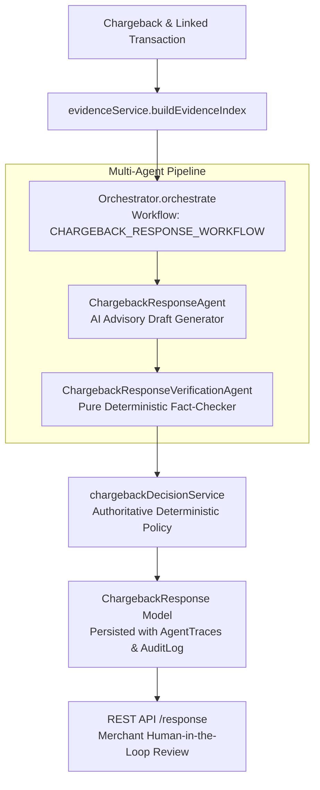

# Phase 2O — Automated Defensive Response & Decision System

## Overview

Phase 2O builds the automated defensive response and decision subsystem for RiskyPlay. It translates dispute case details, linked transaction metadata, and structured evidence from the Evidence Vault into formal, evidence-grounded chargeback rebuttal drafts with rigorous deterministic fact-checking and canonical policy recommendations.

> [!IMPORTANT]
> **Defense-Only Scope & Non-Execution Boundary**:
> The response system drafts and verifies rebuttal documentation for merchant review. It does **not** autonomously submit disputes to card schemes, does **not** initiate refunds, does **not** ban customer accounts, and does **not** perform financial transactions. Rebuttals remain in human-reviewable statuses (`DRAFT`, `VERIFIED`, `VERIFIED_WITH_WARNINGS`, `REJECTED`).

---

## 1. System Architecture



---

## 2. Multi-Agent Defensive Pipeline

The chargeback response workflow is strictly sequenced:

1. **`ChargebackResponseAgent` (AI Advisory)**:
   - Evaluates dispute reason, transaction attributes, and indexed evidence items.
   - Generates a structured formal rebuttal draft, key arguments citing evidence IDs, a suggested recommendation, and confidence score.
   - Never acts as canonical decision authority; output is strictly treated as advisory.

2. **`ChargebackResponseVerificationAgent` (Deterministic Guardrail)**:
   - Never calls an LLM; executes pure deterministic algorithmic checks.
   - **Evidence Grounding**: Verifies that every cited evidence ID exists in the chargeback vault. Flags unknown IDs as `MISSING_EVIDENCE_ID`.
   - **Factual Cross-Referencing**: Extracts dollar amounts and dates from rebuttal text and verifies them against transaction and evidence records. Flags mismatches as `UNSUPPORTED_AMOUNT` or `UNSUPPORTED_DATE`.
   - **Safety Boundary Enforcement**: Screens against prohibited customer fraud accusations (`UNSUPPORTED_FRAUD_CLAIM`) and dispute outcome guarantees or fake submission assertions (`UNSUPPORTED_OUTCOME_CLAIM`).

3. **`chargebackDecisionService` (Deterministic Policy Authority)**:
   - Synthesizes evidence completeness score, missing critical categories, and verification status.
   - Maps inputs to the canonical recommendation:
     - `DEFEND`: High completeness (>= 70), zero missing critical types, clean verification.
     - `DEFEND_WITH_REVIEW`: Moderate completeness (40-69), single missing critical type, or verification warnings.
     - `INSUFFICIENT_EVIDENCE`: Low completeness (< 40) or multiple missing critical types.
     - `DO_NOT_RECOMMEND_DEFENSE`: Verification failed with prohibited claims or ungrounded citations.

---

## 3. Epistemic Grounding & Safety Constraints

### Distinction of Claim Types
- **OBSERVED FACT**: Verifiable directly from transaction records or signed carrier receipts (e.g., "Tracking 1Z999 delivered to zip code 90210 on 2026-08-10").
- **INFERENCE**: Logical deductions explicitly labeled (e.g., "Delivery confirmation matches the billing postal code provided at checkout").
- **UNKNOWN**: Gaps in evidence explicitly acknowledged rather than hallucinated.

### Strictly Prohibited Claims
Rebuttal texts and summaries are algorithmically rejected if they contain:
- Accusations of customer bad faith or crime: *"cardholder is lying"*, *"fraudster"*, *"stolen card"*, *"scammer"*.
- Outcome promises or network guarantees: *"we will win"*, *"guaranteed victory"*, *"issuer must reverse"*.
- Premature submission assertions: *"has been submitted to Visa"*, *"submission complete"*.

---

## 4. REST API Reference

All routes require merchant JWT authentication and enforce strict tenant isolation.

### Endpoints

| Method | Endpoint | Description |
| :--- | :--- | :--- |
| `POST` | `/api/v1/chargebacks/:chargebackId/response/generate` | Executes multi-agent rebuttal generation and persists response |
| `GET` | `/api/v1/chargebacks/:chargebackId/response` | Retrieves the latest stored response draft for the chargeback |
| `POST` | `/api/v1/chargebacks/:chargebackId/response/verify` | Runs deterministic fact-checking on current or overridden response |

### Sample `POST /generate` Response (HTTP 201)

```json
{
  "success": true,
  "data": {
    "_id": "67cb29969185a6a42207399a",
    "merchantId": "67cb29969185a6a422073991",
    "chargebackId": "67cb29969185a6a422073993",
    "transactionId": "67cb29969185a6a422073992",
    "responseText": "This is a formal rebuttal for dispute CB-RESP-CASE-A regarding transaction TX-CB-RESP-A in the amount of $199.99...",
    "responseSummary": "High evidence completeness (85/100) with zero missing critical evidence types. Response draft verified with full factual grounding and zero claim violations",
    "keyArguments": [
      {
        "claim": "Merchandise was delivered with carrier tracking 1Z9999999999999999",
        "evidenceIds": ["67cb29969185a6a422073994"]
      }
    ],
    "evidenceReferences": ["67cb29969185a6a422073994"],
    "unsupportedClaims": [],
    "verification": {
      "status": "VERIFIED",
      "warnings": [],
      "scoreDelta": 0,
      "isGroundingValid": true,
      "verifiedAt": "2026-09-05T15:45:00.000Z"
    },
    "recommendation": "DEFEND",
    "confidence": 85,
    "status": "VERIFIED",
    "generatedAt": "2026-09-05T15:45:00.000Z"
  },
  "orchestration": {
    "runId": "1a2b3c4d-5e6f-7a8b-9c0d-1e2f3a4b5c6d",
    "status": "COMPLETED",
    "decision": {
      "recommendation": "DEFEND",
      "confidence": 0.85,
      "authority": "DETERMINISTIC_POLICY"
    }
  }
}
```

---

## 5. Persistence, Traces, & Audit Logs

1. **`ChargebackResponse` Model**:
   - Stores `keyArguments`, `evidenceReferences`, `unsupportedClaims`, `verification`, `recommendation`, `confidence` (integer 0-100), and lifecycle `status`.
   - Compound indexes on `{ merchantId: 1, chargebackId: 1, createdAt: -1 }`.

2. **`AgentTrace` Integration**:
   - Recorded for each executing agent step in the rebuttal pipeline.
   - `entityType` set to `'CHARGEBACK_REBUTTAL'`.
   - `entityId` set to `chargebackId`.
   - Stores operational reasoning without chain-of-thought scratchpad tokens.

3. **`AuditLog` Audit Trail**:
   - Records actions: `GENERATE_CHARGEBACK_RESPONSE` and `VERIFY_CHARGEBACK_RESPONSE`.
   - Captures previous/new state, actor ID, and operational reasoning.
