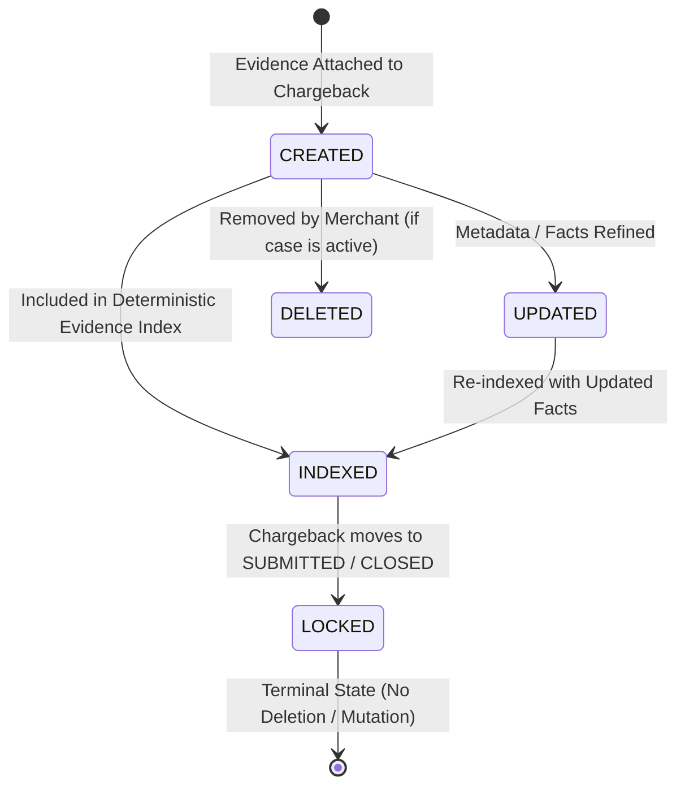

# Phase 2N — Evidence Intelligence & Evidence Vault Architecture

## Overview

The Evidence Intelligence & Evidence Vault subsystem provides a tenant-isolated, normalized repository for dispute evidence. It allows merchants to securely associate evidence records with chargebacks, store bounded metadata without raw file payloads, record structured observable facts, and generate a deterministic evidence index with consistency warnings for downstream response agents.

> [!IMPORTANT]
> **Defense-Only Scope & Non-Execution Boundary**:
> The evidence layer records and organizes observable facts. It does **not** independently determine fraud, legal liability, or dispute outcome. It does not issue refunds, ban customers, or submit dispute packets to card networks.

---

## 1. Evidence Lifecycle

Evidence records are associated with open dispute cases and follow an immutable-once-submitted lifecycle:



- **Creation**: Merchants attach evidence records to `OPEN`, `UNDER_REVIEW`, or `RESPONSE_READY` chargebacks. Evidence cannot be attached to `CLOSED` cases.
- **Modification**: Title, description, source, file metadata, and extracted facts can be refined until the dispute is submitted.
- **Deletion**: Allowed only when the chargeback is active. Once a case reaches `SUBMITTED`, `WON`, `LOST`, or `CLOSED`, evidence is immutable and cannot be deleted.
- **Indexing**: An on-demand deterministic index compiles facts, evaluates category coverage, and performs cross-consistency checks against the underlying transaction.

---

## 2. Evidence Types & Sources

RiskyPlay supports 10 core evidence categories alongside legacy aliases:

| Category | Type Code | Description | Typical Extracted Facts |
| :--- | :--- | :--- | :--- |
| **Order** | `ORDER` | Order confirmation, invoices, checkout carts | `orderId`, `orderStatus`, `orderAmount`, `orderTimestamp` |
| **Payment** | `PAYMENT` | Gateway receipts, AVS/CVV matching signals | `paymentMethod`, `avsResult`, `cvvMatch`, `authCode` |
| **Customer** | `CUSTOMER` | Customer profile, account age, order history | `customerId`, `accountAgeDays`, `priorSuccessfulOrders` |
| **Shipping** | `SHIPPING` | Dispatch manifests, carrier label creation | `carrier`, `trackingNumberMasked`, `shippedAt` |
| **Delivery** | `DELIVERY` | Carrier proof of delivery, GPS, signatures | `deliveryStatus`, `deliveredAt`, `signingParty` |
| **Communication**| `COMMUNICATION` | Emails, chat transcripts, SMS notifications | `channel`, `customerResponsePresent`, `timestamp` |
| **Refund** | `REFUND` | Store credit, partial refund documentation | `refundStatus`, `refundAmount`, `refundTimestamp` |
| **Product** | `PRODUCT` | Digital access logs, download history, terms | `downloadCount`, `firstAccessedAt`, `ipAddress` |
| **Identity** | `IDENTITY` | KYC verification, 3D Secure status | `threeDSecureVersion`, `authenticationStatus` |
| **Other** | `OTHER` | Miscellaneous merchant records | Any safe observable key/value pair |

### Controlled Evidence Sources
- `MERCHANT_SYSTEM`: Automated warehouse or store database records.
- `CARRIER`: Integrated carrier tracking APIs (FedEx, UPS, USPS, DHL).
- `PAYMENT_PROCESSOR`: Acquirer or payment gateway verification feeds.
- `CUSTOMER_SUPPORT`: CRM or support ticket logs.
- `CUSTOMER`: Direct customer emails or dispute correspondence.
- `MANUAL`: Operator-uploaded documents.
- `SYSTEM`: Automated internal dispute engine collection.

---

## 3. Data Model

The `Evidence` schema enforces multi-tenant isolation and references both `Chargeback` and `Transaction`:

```javascript
{
  merchantId: ObjectId,         // Tenant partition key (indexed)
  chargebackId: ObjectId,       // Parent dispute case (indexed)
  transactionId: ObjectId,      // Underlying financial transaction (indexed)
  type: String,                 // Controlled evidence category
  title: String,                // Human-readable title (max 200 chars)
  description: String,          // Optional details (max 2000 chars)
  source: String,               // Provenance source enum
  fileMetadata: {
    filename: String,           // Sanitized filename (no path traversal, max 255)
    mimeType: String,           // Standard MIME type (max 100)
    sizeBytes: Number,          // Bounded size <= 50MB (52,428,800 bytes)
    storageKey: String          // Secure object storage pointer (no path traversal)
  },
  extractedFacts: [{
    key: String,                // Fact descriptor (no secrets/PAN/CVV)
    value: Mixed,               // Observable value
    confidence: Number,         // Confidence score (0.0 to 1.0, default 1.0)
    verified: Boolean           // Operator or system verification flag
  }],
  collectedAt: Date             // Observable intake timestamp
}
```

Raw file bytes are **never** stored in MongoDB. Documents are kept lightweight and normalized.

---

## 4. Structured Extracted Facts

Extracted facts model observable information only. They are strictly validated against credential and payment data leaks:
- Prohibited in `key` or `value`: `pan`, `cvv`, `cvc`, `pin`, `password`, `token`, `jwt`, `apiKey`, `secret`, `cardnumber`.
- Values are bounded to a maximum of 1,000 characters.

Example of safe extracted facts:
```json
[
  { "key": "deliveryStatus", "value": "DELIVERED", "confidence": 1.0, "verified": true },
  { "key": "trackingNumberMasked", "value": "1Z999***01", "confidence": 1.0, "verified": true },
  { "key": "deliveredAt", "value": "2026-09-02T14:30:00.000Z" }
]
```

---

## 5. Deterministic Evidence Index

Downstream chargeback-response agents require a stable, reproducible representation of available evidence. The index compiles:
1. **Evidence Count**: Total attached records.
2. **Category Distribution**: Counts per category.
3. **Sorted Facts**: Facts ordered deterministically by `category ASC`, `fact key ASC`, and `sourceEvidenceId ASC`.
4. **Coverage Map**: Booleans indicating presence of critical dispute defense categories (`order`, `payment`, `shipping`, `delivery`, `communication`, `refund`, `customer`, `identity`, `product`).
5. **Consistency Warnings**: Automated conflict detection.

### Index Output Structure
```json
{
  "chargebackId": "66da921ea2c91b4e8832a105",
  "transactionId": "66da91f3a2c91b4e8832a101",
  "caseNumber": "CB-VISA-88291",
  "evidenceCount": 3,
  "categories": {
    "ORDER": 1,
    "PAYMENT": 0,
    "CUSTOMER": 0,
    "SHIPPING": 1,
    "DELIVERY": 1,
    "COMMUNICATION": 0,
    "REFUND": 0,
    "PRODUCT": 0,
    "IDENTITY": 0,
    "OTHER": 0
  },
  "facts": [
    {
      "sourceEvidenceId": "66da93a1a2c91b4e8832a110",
      "category": "DELIVERY",
      "fact": "deliveryStatus",
      "value": "DELIVERED",
      "confidence": 1.0,
      "verified": true
    },
    {
      "sourceEvidenceId": "66da939fa2c91b4e8832a109",
      "category": "ORDER",
      "fact": "orderAmount",
      "value": 199.99,
      "confidence": 1.0,
      "verified": true
    }
  ],
  "coverage": {
    "order": true,
    "payment": false,
    "shipping": true,
    "delivery": true,
    "communication": false,
    "refund": false,
    "customer": false,
    "identity": false,
    "product": false
  },
  "warnings": [],
  "generatedAt": "2026-09-05T20:45:00.000Z"
}
```

---

## 6. Consistency Warnings

The engine detects factual contradictions between evidence records and the disputed transaction:

| Warning Code | Severity | Trigger Condition |
| :--- | :--- | :--- |
| **`TRANSACTION_ID_MISMATCH`** | `WARNING` | An evidence document references a transaction ID different from the chargeback. |
| **`ORDER_AMOUNT_MISMATCH`** | `WARNING` | An extracted `orderAmount` differs from the transaction amount by $> \$0.01$. |
| **`REFUND_EXCEEDS_DISPUTE`** | `WARNING` | An extracted `refundAmount` exceeds the transaction/dispute total. |
| **`DELIVERY_BEFORE_ORDER`** | `WARNING` | An extracted `deliveredAt` timestamp is chronologically prior to `orderTimestamp`. |

Warnings inform downstream agents of potential inconsistencies without corrupting or deleting merchant data.

---

## 7. Tenant Isolation & Security

1. **Strict Ownership Scoping**:
   - `merchantId` is enforced from `req.user.merchantId`. Client-supplied IDs are stripped and ignored.
   - All queries filter by `{ merchantId, chargebackId }`.
   - Accessing another tenant's chargeback or evidence returns **HTTP 404** to prevent ID enumeration.
2. **Path Traversal Defense**:
   - `filename` and `storageKey` fields are checked against `..`, `../`, and `..\` patterns. Violations are rejected with HTTP 400.
3. **No File Execution**:
   - No filesystem paths are executed, read, or resolved on the host server.

---

## 8. Audit Logging

Every lifecycle action produces an immutable `AuditLog` entry:
- `EVIDENCE_CREATED`: Logged upon successful attachment.
- `EVIDENCE_UPDATED`: Logged when metadata or facts are edited.
- `EVIDENCE_DELETED`: Logged upon removal.
- `EVIDENCE_INDEX_BUILT`: Logged each time the index is compiled.

---

## 9. REST API Reference

All endpoints are mounted under `/api/v1/chargebacks/:chargebackId/evidence` and require a valid Bearer JWT.

| Method | Path | Description | Response Code |
| :--- | :--- | :--- | :--- |
| `POST` | `/` | Create and attach evidence | `201 Created` |
| `GET` | `/` | List evidence with pagination & filters | `200 OK` |
| `GET` | `/index` | Build & retrieve evidence index | `200 OK` |
| `GET` | `/:evidenceId` | Retrieve single evidence details | `200 OK` |
| `PATCH` | `/:evidenceId` | Update metadata and extracted facts | `200 OK` |
| `DELETE` | `/:evidenceId` | Delete evidence (active cases only) | `200 OK` |

---

## 10. Future Agent Integration (Phase 2O)

In the next phase, the **Chargeback Rebuttal Agent** will consume this layer:
1. Agent receives `AgentContext` containing the chargeback and transaction.
2. Agent invokes `evidenceService.buildEvidenceIndex()` to retrieve verified facts and coverage booleans.
3. If consistency warnings exist, the agent factors them into its rebuttal narrative.
4. Agent generates a network-compliant defense packet saved to `Chargeback.generatedResponse`.
