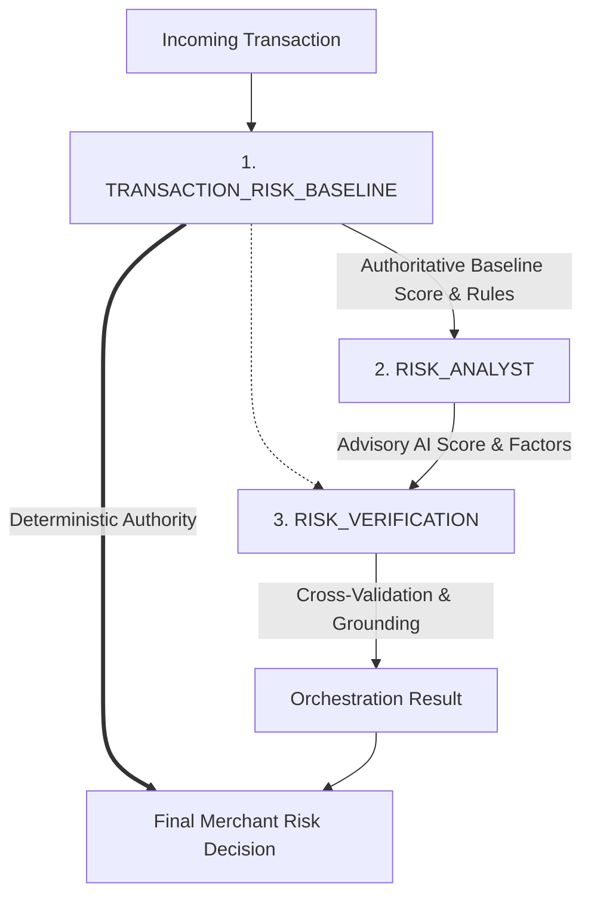

# Specialized Risk & Verification Agents Architecture (Phase 2L)

## 1. Executive Summary & Design Principles

Phase 2L extends RiskyPlay's multi-agent orchestration architecture into a comprehensive defense-only transaction-risk workflow. The workflow coordinates three specialized agents:
1. **`TRANSACTION_RISK_BASELINE`**: Authoritative deterministic risk scoring engine.
2. **`RISK_ANALYST`**: Advisory AI risk analysis via the existing AI service client (`aiRiskService.js`).
3. **`RISK_VERIFICATION`**: Deterministic cross-validation, threshold alignment, contract enforcement, and factor grounding.

> [!IMPORTANT]
> **"AI output is advisory and does not override the deterministic merchant risk decision."**
> 
> The final risk decision (`decision.riskScore`, `decision.riskTier`, `decision.recommendation`, `decision.authority = 'DETERMINISTIC_BASELINE'`) is derived exclusively from the deterministic risk engine. AI provides supplemental reasoning, explanations, and comparative metrics without possessing unilateral decision authority.

> [!WARNING]
> **"Semantic grounding of free-form language cannot be guaranteed purely through deterministic post-processing; unsupported claims are therefore flagged rather than treated as verified facts."**

---

## 2. Workflow Architecture & Lifecycle

The execution sequence is strictly defined by `TRANSACTION_RISK_WORKFLOW`:



### Execution Flow:
1. **Baseline Assessment (`TRANSACTION_RISK_BASELINE`)**:
   - Executes authoritative deterministic risk rules (`riskService.calculateRisk`).
   - Produces baseline `riskScore`, `riskTier`, `recommendation`, `matchedRules`, `signals`.
2. **Advisory AI Analysis (`RISK_ANALYST`)**:
   - Consumes sanitized transaction context and baseline output.
   - Calls existing `aiRiskService.analyzeTransactionRisk` (never communicates with external providers directly).
   - If AI service is available: emits advisory `aiScore`, `aiTier`, `aiRecommendation`, `summary`, `riskFactors`.
   - If AI service is unavailable: gracefully degrades with `status: 'UNAVAILABLE'` and `aiScore: null` without halting the pipeline.
3. **Deterministic Verification (`RISK_VERIFICATION`)**:
   - Purely deterministic; **never** invokes an LLM.
   - Verifies baseline invariants (0–29 LOW/APPROVE, 30–69 MEDIUM/REVIEW, 70–100 HIGH/DECLINE).
   - Validates AI response contract and threshold alignment.
   - Computes mathematical delta: `scoreDelta = |aiScore - baselineScore|`, `tierAgreement`, `recommendationAgreement`.
   - Evaluates risk factors against observable transaction evidence.
   - Flags speculative/hallucinatory claims as `UNSUPPORTED_CLAIM`.
   - Produces final verification status (`VERIFIED`, `VERIFIED_WITH_WARNINGS`, `REJECTED`, or `AI_UNAVAILABLE`).

---

## 3. Specialized Agent Specifications

### 3.1. `TransactionRiskBaselineAgent`
- **Identifier**: `TRANSACTION_RISK_BASELINE`
- **Role**: Baseline risk authority.
- **Implementation**: [`server/src/agents/agents/TransactionRiskBaselineAgent.js`](file:///c:/Users/yerra/OneDrive/Desktop/RiskyPlay/server/src/agents/agents/TransactionRiskBaselineAgent.js)
- **Dependencies**: None.
- **Authority**: Canonical financial and risk scoring authority.

### 3.2. `RiskAnalystAgent`
- **Identifier**: `RISK_ANALYST`
- **Role**: Advisory AI evaluation and explanatory reasoning.
- **Implementation**: [`server/src/agents/agents/RiskAnalystAgent.js`](file:///c:/Users/yerra/OneDrive/Desktop/RiskyPlay/server/src/agents/agents/RiskAnalystAgent.js)
- **Dependencies**: Requires `TRANSACTION_RISK_BASELINE`.
- **Safety Boundaries**:
  - No direct LLM/transport execution.
  - No secrets or API credentials.
  - No `req`/`res` or database mutation.
  - Never invents an AI score on failure.

### 3.3. `RiskVerificationAgent`
- **Identifier**: `RISK_VERIFICATION`
- **Role**: Deterministic cross-agent guardrails and factor grounding.
- **Implementation**: [`server/src/agents/agents/RiskVerificationAgent.js`](file:///c:/Users/yerra/OneDrive/Desktop/RiskyPlay/server/src/agents/agents/RiskVerificationAgent.js)
- **Dependencies**: Requires `TRANSACTION_RISK_BASELINE` and `RISK_ANALYST`.
- **Safety Boundaries**:
  - 100% deterministic (no LLM).
  - Never interprets `aiScore` as a probability.
  - Never overrides deterministic baseline decision.

---

## 4. Verification Statuses & Evaluation Logic

The verification agent assigns one of four explicit statuses:

| Verification Status | Description | Preconditions |
|---|---|---|
| `VERIFIED` | Clean consensus; all factors grounded | AI succeeded, contract valid, thresholds consistent, all factors verified with observable evidence. |
| `VERIFIED_WITH_WARNINGS` | Advisory accepted with caveats | AI contract valid, but one or more factors contain unsupported claims (`UNSUPPORTED_CLAIM`) or lack observable context (`UNVERIFIED`). |
| `REJECTED` | AI output failed contract | AI score violates range (not int 0–100), AI tier disagrees with score threshold, or recommendation disagrees with tier. Baseline authority remains preserved. |
| `AI_UNAVAILABLE` | Graceful fallback | AI service unreachable, network timeout, or skipped. Baseline authority remains preserved. |

### Factor Grounding & Unsupported Claims

#### Unsupported Claim Detection (`UNSUPPORTED_CLAIM`):
The verification agent flags factors asserting facts beyond the transaction context:
- Account takeover / ATO
- Stolen or lost payment card
- Fraud certainty (e.g. "proven fraud", "confirmed fraud")
- Known fraudulent device / known bad IP / botnet
- Customer prior fraud or chargeback history
- External fraud databases / blacklists / Interpol

#### Observable Context Grounding (`GROUNDED` vs `UNVERIFIED`):
Factors are mapped against observable transaction metadata:
- Transaction amount, currency, and value thresholds
- Cart items, item prices, quantities, and totals
- Customer email, domain structure, and presence
- Payment method metadata (cardBin, cardType, issuerCountry)
- Triggered deterministic rules and signals

Factors lacking direct correlation to these observables are marked `UNVERIFIED`.

---

## 5. Operational Trace Model (`AgentTrace`)

Each execution step is recorded in MongoDB in the `AgentTrace` collection with no raw chain-of-thought, prompt scratchpads, or sensitive credentials:

```json
{
  "runId": "c8f352bf-7901-4974-9f89-7e3fef9b736b",
  "entityType": "TRANSACTION_RISK",
  "entityId": "64a1b2c3d4e5f6a7b8c9d001",
  "agentName": "RISK_VERIFICATION",
  "stepIndex": 2,
  "status": "COMPLETED",
  "latencyMs": 4,
  "reasoning": "{\"evidenceConsidered\":[\"deterministic baseline score 75 (HIGH)\",\"AI analyst status 'SUCCESS' (score: 80)\",\"1 risk factor(s) evaluated\"],\"validationPerformed\":[\"baseline authority check\",\"AI response contract validation\",\"threshold alignment verification\",\"observable evidence factor grounding\",\"unsupported speculative claim detection\"],\"decisionProduced\":\"Verification completed with status 'VERIFIED'\"}"
}
```

---

## 6. API Response Specification

### `POST /api/v1/transactions/:id/risk/orchestrate`

#### Example Response (HTTP 200)

```json
{
  "success": true,
  "data": {
    "runId": "c8f352bf-7901-4974-9f89-7e3fef9b736b",
    "merchantId": "507f1f77bcf86cd799439011",
    "transactionId": "64a1b2c3d4e5f6a7b8c9d001",
    "status": "COMPLETED",
    "decision": {
      "riskScore": 75,
      "riskTier": "HIGH",
      "recommendation": "DECLINE",
      "authority": "DETERMINISTIC_BASELINE"
    },
    "agents": [
      {
        "agentName": "TRANSACTION_RISK_BASELINE",
        "agentVersion": "1.0.0",
        "status": "COMPLETED",
        "output": {
          "riskScore": 75,
          "riskTier": "HIGH",
          "recommendation": "DECLINE",
          "signalsCount": 2,
          "matchedRulesCount": 2,
          "matchedRules": ["HIGH_VALUE_TRANSACTION", "CART_TOTAL_MISMATCH"],
          "signals": [ ... ]
        },
        "error": null,
        "latencyMs": 5
      },
      {
        "agentName": "RISK_ANALYST",
        "agentVersion": "1.0.0",
        "status": "COMPLETED",
        "output": {
          "status": "SUCCESS",
          "aiScore": 80,
          "aiTier": "HIGH",
          "aiRecommendation": "DECLINE",
          "summary": "Elevated transaction amount with cart discrepancy.",
          "riskFactors": [
            {
              "code": "HIGH_AMOUNT",
              "description": "Transaction amount exceeds high-value threshold",
              "severity": "HIGH"
            }
          ],
          "baselineScore": 75
        },
        "error": null,
        "latencyMs": 142
      },
      {
        "agentName": "RISK_VERIFICATION",
        "agentVersion": "1.0.0",
        "status": "COMPLETED",
        "output": {
          "status": "VERIFIED",
          "baselineAuthority": {
            "riskScore": 75,
            "riskTier": "HIGH",
            "recommendation": "DECLINE",
            "verified": true
          },
          "comparison": {
            "baselineScore": 75,
            "aiScore": 80,
            "scoreDelta": 5,
            "tierAgreement": true,
            "recommendationAgreement": true
          },
          "factorAnalysis": [
            {
              "code": "HIGH_AMOUNT",
              "description": "Transaction amount exceeds high-value threshold",
              "severity": "HIGH",
              "groundingStatus": "GROUNDED",
              "reason": "Supported by observable transaction or baseline context"
            }
          ],
          "warnings": [],
          "verifiedAt": "2026-09-05T13:45:00.000Z"
        },
        "error": null,
        "latencyMs": 3
      }
    ],
    "verification": {
      "status": "VERIFIED",
      "baselineAuthority": {
        "riskScore": 75,
        "riskTier": "HIGH",
        "recommendation": "DECLINE",
        "verified": true
      },
      "comparison": {
        "baselineScore": 75,
        "aiScore": 80,
        "scoreDelta": 5,
        "tierAgreement": true,
        "recommendationAgreement": true
      },
      "factorAnalysis": [ ... ],
      "warnings": [],
      "verifiedAt": "2026-09-05T13:45:00.000Z"
    },
    "finalResult": {
      "runId": "c8f352bf-7901-4974-9f89-7e3fef9b736b",
      "status": "COMPLETED",
      "executedAgentCount": 3,
      "primaryAssessment": { ... }
    },
    "createdAt": "2026-09-05T13:45:00.000Z"
  }
}
```

---

## 7. Security Boundaries & Invariants

1. **Zero Offensive Capabilities**: No mechanisms exist for executing financial operations (refunds, transfers, chargeback dispute submissions, or merchant account bans).
2. **Deterministic Primacy**: In all scenarios—including AI service outage, network timeout, contract validation failure, or threshold disagreement—the canonical decision defaults directly to the deterministic risk engine.
3. **Tenant Boundary Enforcement**: `merchantId` is extracted exclusively from the authenticated JWT token and verified against the database transaction record. Unauthorized merchant requests return HTTP `404 Not Found` with zero trace generation.
4. **PII Sanitization**: PAN, CVV, password hashes, and user authentication tokens are stripped from `AgentContext` upon creation and never persisted in `AgentTrace`.
